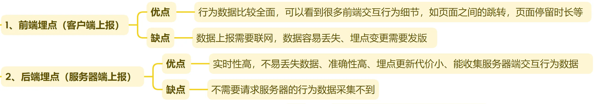
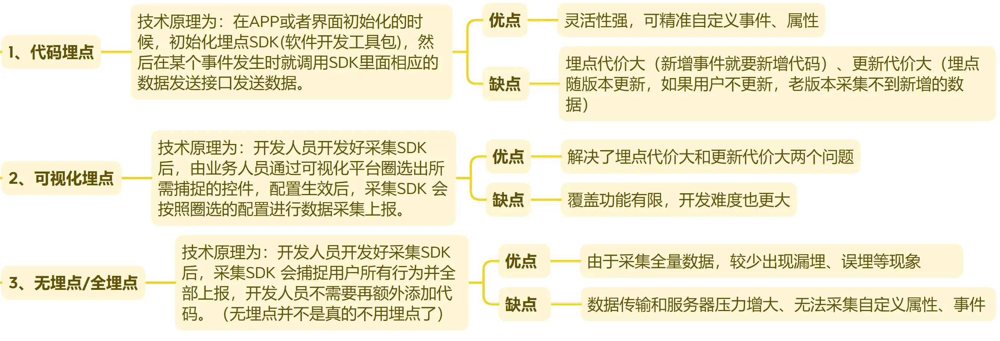
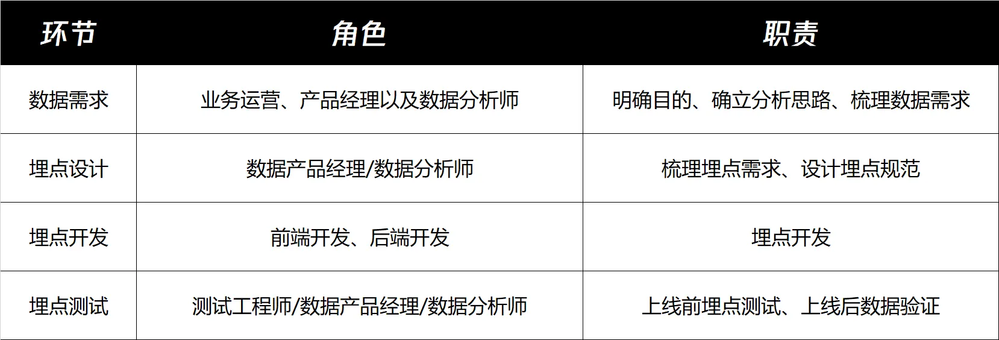
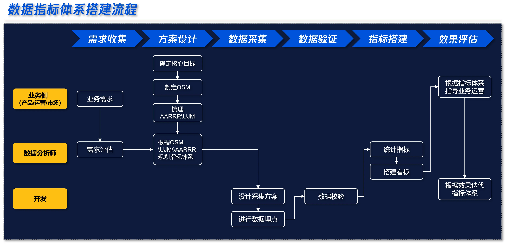
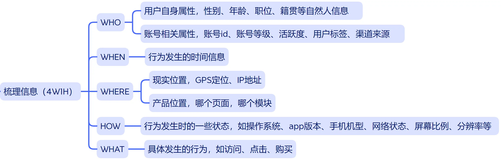
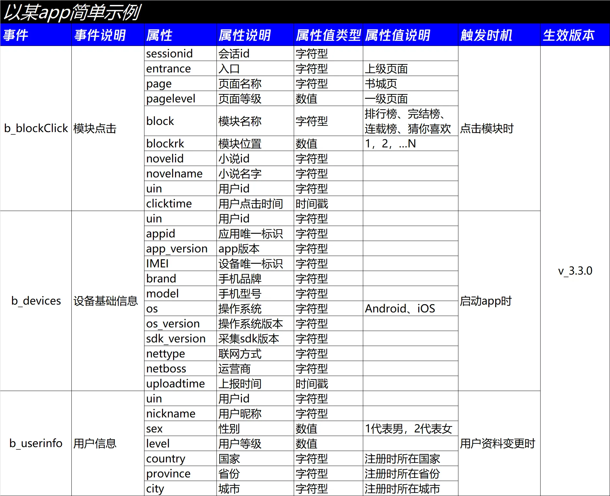
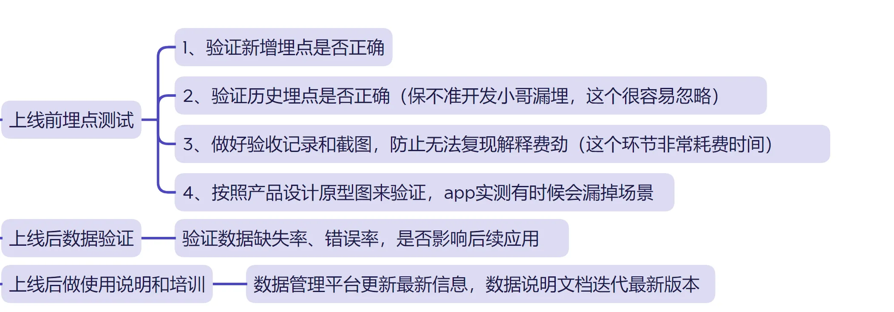
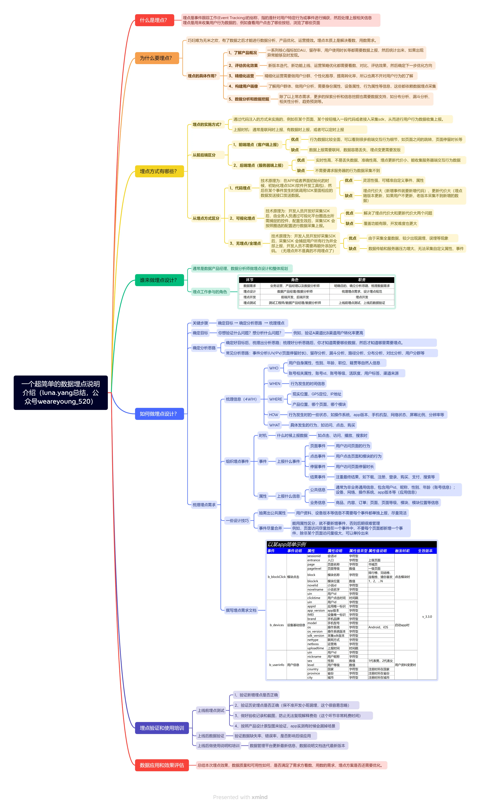

> 文末有完整思维导图、总结提炼。

移动互联网时代，看数、用数是产品运营的必备操作，但应用数据的前提是——有数可用，否则巧妇难为无米之炊。数据从生产到应用的流程一般是：数据采集 → 数据传输 → 数据预处理 → 数据统计/分析/挖掘 → 数据可视化 → 效果评估，所以采集数据是非常重要的环节，这个工作业内叫做数据埋点。
## **一、什么是埋点？**

埋点是事件跟踪工作(Event Tracking)的俗称，指的是针对用户特定行为或事件进行捕获，然后处理上报相关信息。埋点是用来收集用户行为数据的，例如查看用户点击了哪些按钮，浏览了哪些页面。
 
## **二、为什么要埋点？**

巧妇难为无米之炊，有了数据之后才能进行数据分析、产品优化、运营提效。埋点本质上是解决看数、用数需求。数据埋点的质量直接决定了数据的可用性。
 
## **三、埋点的具体作用有哪些？**

数据埋点通常是为了解决用户洞察、问题发现、产品优化和运营提效等业务需求。
**1、****了解产品概况**
一系列核心指标如DAU、留存率、用户使用时长等都需要数据上报，然后统计出来，如果出现异常能够及时发现。
**2、****评估优化效果**
新版本迭代、新功能上线、运营策略优化都需要看数、对比、评估效果，然后确定下一步优化方向。
**3、****精细化运营**
精细化运营需要做用户分群、个性化推荐，提高转化率，所以也离不开对用户行为的了解。
**4****、构建用户画像**
了解用户群体、做用户分析，需要身份属性、设备属性、行为属性等信息，这些都依赖数据埋点采集。
**5****、数据分析和数据挖掘**
除了以上常态需求，更多的探索分析和信息挖掘也需要数据支持，如分布分析、漏斗分析、相关性分析、趋势趋势/规模等。
 
## **四、埋点方式有哪些？**

数据埋点是通过代码注入的方式来实施的，例如在某个页面、某个按钮植入一段代码或者接入采集sdk，从而进行用户行为数据收集上报。
1、从前后端分可以分为：**客户端埋点**和**服务器端埋点**，通常会搭配使用
如果要查看丰富的前端交互行为，客户端埋点更有优势，例如页面跳转、停留时长；如果对数据实时性、准确性要求非常高，服务器端埋点更有优势，例如购买、支付、搜索查询等数据。

2、从埋点方式可分为：**代码埋点、可视化埋点、无埋点（全埋点）**，这三种方式都是要写代码的，差别可以简单理解为：         代码埋点：你需要啥我埋啥，你不需要我就不埋         可视化埋点：我覆盖一些，你要啥自己圈定控件新增事件         无埋点（全埋点）：全量数据采集上报，你要啥自己筛选以上几种方式各有利弊：

## **五、谁来做埋点设计？**

通常是数据产品经理、数据分析师来做埋点设计和整体规划，主要参与人员如下：

## **六、如何做埋点设计？**

上一篇文章梳理数据指标体系搭建流程时，提到过数据埋点这个环节。从中可以看到业务需求是起点，确定了目标和分析思路后，才会推进到数据埋点这个环节。

数据埋点设计的关键环节有3个：**确定目标→确定分析思路→梳理埋点需求。**
### **1、****确定目标**

埋点是从业务需求出发的，有需求才会去埋点。所以你要说清楚，你想验证什么问题？你想分析什么问题？例如，验证A渠道比B渠道用户转化率更高、想看看新功能上线后用户使用情况如何等。### **2、****确定分析思路**

确定好目标后，梳理出分析思路；梳理好分析思路后，你才知道需要哪些数据；知道要哪些数据，你才知道哪里需要埋点。常见分析思路有：事件分析(UV/PV/页面停留时长等)、留存分析、漏斗分析、路径分析、分布分析、对比分析、用户分群等。### **3、****梳理埋点需求**

这个环节主要有3个步骤：**梳理信息、组织埋点事件、撰写埋点需求文档。**### **（1）梳理信息**

埋点需要关注哪些信息呢？我们可以借助4w1h模型（who、when、where、what、how）来划分埋点属性，主要包含身份信息、时间信息、位置信息、状态信息、行为信息，具体如下：

### 
  **（2）组织埋点事件**

埋点事件一般包含3个要素：时机、事件、属性。时机：什么时候上报数据，如点击、访问、播放时事件：上报什么事件，如页面事件、点击事件、停留事件、结果事件属性：上报什么信息，公共信息（非业务通用信息，账号设备等）、业务信息（页面、模块、内容、订单等）通过上个环节的梳理，我们知道一个事件通常会包含身份、时间、位置、状态、行为等属性，我们可以从中挑选所需信息进行组合。组合的过程中注意确认：
    ①位置信息：页面、区域、模块（什么页面、什么区域、什么模块）
    ②层级信息：页面等级（一级页面、二级页面、三级页面）、区域id（第1屏、第2屏…）、模块顺序（左、中、右）、内容类型层级（如 男频-玄幻-东方玄幻）
    ③数据类型：数值、字符型、布尔型、时间格式等    ④属性值范围：属性可以填入哪些值### 
  **（3）撰写埋点需求文档**

将事件信息整理填入埋点需求文档，主要对事件、属性、触发时机、生效版本等进行说明。简单示例如下：

## **七、埋点验证和使用培训**

此阶段主要工作是上线前的埋点测试以及上线后的数据验证，这个环节问题很多发，比较需要细心和耐心。例如：灰度版本埋点了，结果正式版本漏掉了…；上线后某个渠道没数据，一看上传错安装包了…；测试时没问题，上线后数据缺失率很高…

 
## **八、总结**

1、想清楚为什么要埋点？埋点的本质是解决看数、用数需求，有需求才埋点。
2、怎么设计埋点？关键环节有3个：确定目标→确定分析思路→ 梳理埋点需求。3、怎么梳理埋点需求？主要步骤3个：梳理信息→组织埋点事件→ 撰写埋点需求文档。4、怎么组织埋点事件？包含3个要素：时机、事件、属性。5、验证埋点对不对？上线前埋点测试，上线后数据验证。6、总结本次埋点效果，是否满足需求方看数、用数需求。

## **九、本文思维导图**
